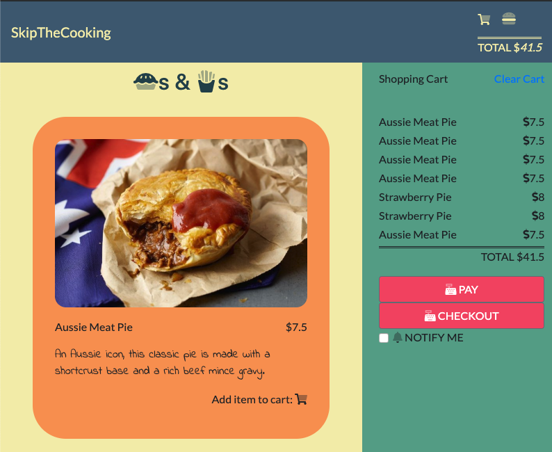
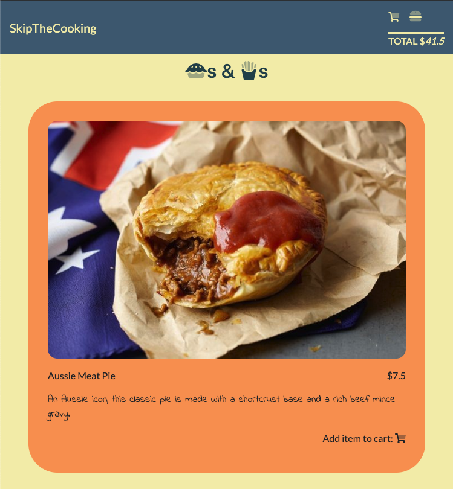
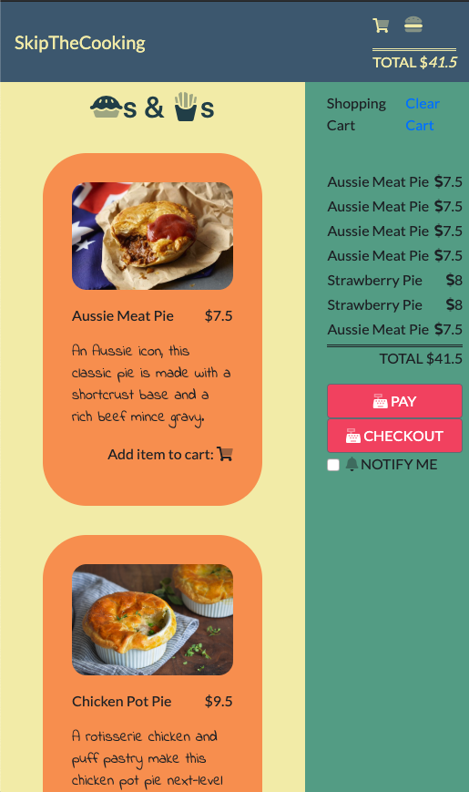

# Skip The Cooking
## Pies & Fries
#### By Lloyd & Terrence
=========
## Project Overview

A food ordering experience for a single restaurant. Hungry clients of this fictitious restaurant can visit its website, select one or more dishes and place an order for pick-up. They will receive a notification when their order is ready.

The restaurant and client are both notified as this app serves as an intermediary.

When an order is placed, the restaurant receives the order via SMS informing them that they have received an order. Additionally the client receives an SMS informing them how long the order will take.   

The modern telecomm API service Twilio was used to implement the SMS communication from the website to the client and restaurant.

## View The Project
Our project is online, use our heroku link below to check it out and play around. 

`Heroku`: https://skip-the-cooking.herokuapp.com/

If you would perfer to run the project on localhost follow the instructions below.

1. Create the `.env` by using `.env.example` as a reference: `cp .env.example .env`
2. Update the .env file with your correct local information 
  - username: `labber` 
  - password: `labber` 
  - database: `midterm`
3. Install dependencies: `npm i`
4. Fix to binaries for sass: `npm rebuild node-sass`
5. Reset database: `npm run db:reset`
  - Check the db folder to see what gets created and seeded in the SDB
7. Run the server: `npm run local`
  - Note: nodemon is used, so you should not have to restart your server
8. Visit `http://localhost:8080/`

## Progress Tracking

Check out which taskes we completed to make this project come alive by using the Trello link below.

`Trello`: https://trello.com/b/3QvqIgqH/skipthecooking

## Dependencies

- "body-parser": "^1.19.0"
- chalk": "^2.4.2"
- "cookie-session": "^1.3.3"
- "dotenv": "^2.0.0"
- "ejs": "^2.6.2"
- "express": "^4.17.1"
- "jquery": "^3.4.1"
- "morgan": "^1.9.1"
- "node-sass-middleware": "^0.11.0"
- "pg": "^6.4.2"
- "pg-native": "^3.0.0"
- "twilio": "^3.36.0"

## Additional Information

This project was designed and created in one week as part of the (Sept 16, 2019 cohort) `Lighthouse Labs` victoria bootcamp midterm.  

## Screen Shots

### Large Screen View

### Hidden Shopping Cart

### Mobile View

